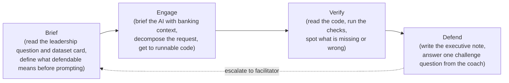

# Module 1 Reframe: Working with AI on Banking Data

> Status: Draft proposal for AJB Module 1 (currently `python-training`).
> Supersedes the "Python for Data" framing in `participant-workbook.md`, the deck slides in `index.html`, and the lab checkpoint copy in `src/lib/training-lab-checkpoints.ts` for the python module.
> Out of scope of this document: visual slide redesign (covered by `.cursor/plans/python_deck_slide_redesign_*.plan.md`, paused until this reframe lands).

## 1. The vision

The modern bank analyst works with AI. So does the modern engineer, the modern researcher, the modern operator. The skill that separates the people who produce trustworthy work from the people who produce confident-looking noise is no longer "can you write the code". It is **can you use AI to get to the truth in the data, and can you defend that truth when challenged**.

This module exists to make AJB analysts genuinely excellent at that. Two things have to be true at the end:

- They are fluent at working with AI on real bank data: briefing it, pressure-testing it, knowing when it is helpful and when it is wrong.
- They have enough technical understanding of bank data that the truths they produce stand up to scrutiny. Definitions are explicit. Cut-offs are honest. Denominators are challengeable. Caveats are visible.

Everything that follows in this document serves those two outcomes.

## 2. Why we are reframing

The original module was designed before the lab chat existed. It treated Python as the deliverable: participants learned to write `pandas` so they could produce defendable analysis of bank extracts. That made sense in 2025.

It does not make sense now. Three things have changed:

- The lab is now an AI workspace. `LabChatShell` (`src/components/training/lab-chat/lab-chat-shell.tsx`) gives every participant a coached chat with dataset attachments, runnable code blocks, auto-validated tasks, and quick actions like "Suggest the next step", "Check my work", "Explain my last error". The chat is how work gets done.
- The audience is bank analysts, not engineers. Their job is to produce trustworthy, defendable analysis. Whether the code is hand-written or AI-assisted is irrelevant if the answer is wrong. Whether the answer is right depends on the judgement they bring to the data.
- The wider programme already covers AI in banking, ML, automation, and business applications in dedicated modules. Module 1 does not need to teach what AI is. It teaches how to use AI well on banking data, so that everything that follows stands on a defendable analytical foundation.

## 3. New module thesis

> **Use AI to surface defendable truths from bank data.**

The participant is the analyst. AI is part of how the work gets done, alongside notebooks, datasets, and judgement. The course teaches the judgement, the prompting craft, and the just-enough Python literacy needed to do the job in a bank.

## 4. Three pillars (with weighting)

| Pillar | Weight | What it covers |
| --- | --- | --- |
| Banking data judgement | ~40% | Denominators, cut-off dates, lineage, what counts as a customer, when null is missing vs zero, plausibility limits, regulatory rounding, the shape of a "fit for first-pass" extract. The part AI cannot do without being briefed. |
| Working with AI: prompting and verification | ~40% | Briefing the AI with banking context, decomposing a vague leadership question, reading code and output critically, asking the AI to pressure-test its own answer, knowing when to stop trusting a thread, recognising when AI is confidently wrong. |
| Just-enough Python literacy | ~20% | Reading not writing. Recognising a `groupby` on the wrong column, a join that silently dropped 30% of rows, a filter that excluded the wrong period. Also: running an AI-generated block in the chat and reading its output. |

Pillar 1 is the new content that did not exist as a first-class topic before. Pillar 3 is an aggressive trim from the current course. Pillar 2 is mostly new and is the connective tissue.

## 5. Pedagogical model: the four-beat loop

Every lab in this module follows the same loop. It is the loop the chat already supports, made explicit and named.



This loop maps onto the existing chat surface:

- **Brief** is what the participant writes in the chat first, before reaching for a quick action. We surface a "Brief the task" prompt as a new quick action.
- **Engage** is the existing free-form chat plus the existing "Suggest the next step" quick action.
- **Verify** is the existing "Check my work" and "Explain my last error" quick actions, plus a new "Pressure-test this" prompt that asks the coach to argue against its own answer.
- **Defend** is a new closing step: the coach surfaces one challenge question from the lab's pre-baked bank; the participant writes a one-paragraph answer; this is the artefact the lab is graded on.

Verification (the third beat) is where bug-spotting habits live: noticing when AI output is plausible but wrong, when a definition has drifted, when a denominator does not survive scrutiny. We treat this as a normal habit of analysis, not a gotcha. It applies whether the code came from AI or was hand-written.

## 6. How we treat known weaknesses in the data

Some labs use extracts that contain known data issues. We tell participants that up front: real bank extracts are not clean, and part of being a useful analyst is finding the issues that matter, whether you put them there yourself, an upstream system did, or no one knows yet.

In each lab brief we say one of:

- **Declared issues**: "this extract has at least one known data quality issue. Find it, decide whether it changes the analytical conclusion, and document what you would do."
- **Mixed**: "this extract has been used before. We know about some of its issues. There may be others we do not. Treat it the way you would treat a real upstream feed."
- **Unspecified**: "this is a fresh extract. We have not pre-screened it. Apply the same checks you would apply to anything that landed in your inbox this morning."

This frames verification as a professional habit, not a trick. It also means the same lab can be run repeatedly with the issues moved around, without the cohort treating "find the bug" as the only goal.

## 7. Challenge questions

Every checkpoint defines its own bank of pre-baked challenge questions. At the Defend beat, the coach picks one (deterministically per participant per lab so peers cannot trade answers, configurably random for facilitators who want variety) and asks it. The participant writes a one-paragraph answer; the answer is the closing artefact of the lab.

Question shape:

- **Definition challenge** - "What does this metric mean if a customer holds three accounts? Defend the choice."
- **Denominator challenge** - "Recompute under [alternative denominator]. Which version would you ship to leadership and why?"
- **Lineage challenge** - "Where did the input you trusted most come from, and what would have to be true upstream for it to still be trustworthy next quarter?"
- **Counterfactual challenge** - "If [data quality issue X] had not been there, would your conclusion change? Show your reasoning."
- **Audience challenge** - "Rewrite your headline for an audience that distrusts the data. What survives?"

Schema additions to `TrainingLabCheckpoint` in `src/lib/training-lab-checkpoints.ts`:

```ts
type ChallengeQuestion = {
  id: string;
  type: "definition" | "denominator" | "lineage" | "counterfactual" | "audience";
  prompt: string;
  rubric: string[]; // what a good answer demonstrates, used by the coach to evaluate
};

// Added to TrainingLabCheckpoint:
challengeQuestions?: ChallengeQuestion[];
```

The coach context publisher includes the selected question id when the participant reaches the Defend beat, so the coach can ask the question, hold the participant to its rubric, and (optionally) follow up with one sharpening question if the answer is shallow.

The facilitator console (`training-facilitator-console.tsx`) gets a small panel that shows which challenge question each participant is currently on, so the facilitator can intervene live if the room needs help.

## 8. Two-day outline

Compressed from the original three days into 2 days x 4 hours = 8 hours total. Four labs, all running the four-beat loop. The handoff is the close.

### Day 1 - Trustworthy data and defendable definitions

Theme: when is a bank extract fit for analysis, and how do you build a metric that survives scrutiny.

| Time | Block |
| --- | --- |
| 0:00 - 0:30 | **Opening.** The vision. The modern analyst works with AI to get truths from bank data. The four-beat loop. The "I can defend this" bar. |
| 0:30 - 0:45 | **Foundations.** Banking data anatomy in 15 minutes. Customer / account / transaction / branch / service. What each means and what each does not mean. Common gotchas. |
| 0:45 - 2:00 | **Lab A: Triage an extract.** Leadership wants to know if a transactions extract is usable for a first performance cut. Participants brief the task, work the loop with the coach, verify with checks they choose, write a one-paragraph defence at the Defend beat. Issues: declared. |
| 2:00 - 2:15 | Break. |
| 2:15 - 3:45 | **Lab B: Define and build a branch KPI.** Leadership wants branch performance for last quarter. Participants write the numerator, denominator, exclusion logic, and cut-off rules before touching the chat. Build with the coach. Recompute under one alternative denominator. Defend the version they would ship. Issues: mixed. |
| 3:45 - 4:00 | **Close.** One thing learned about briefing the AI; one thing learned about defending a definition. |

### Day 2 - Leadership outputs and the ML handoff

Theme: turn analysis into a pack that holds up to challenge, and a handoff that the next analyst (or the next model) can trust.

| Time | Block |
| --- | --- |
| 0:00 - 0:20 | **Opening.** Two audiences for the same evidence. Leadership wants a story; ML wants a contract. Both want defendability. |
| 0:20 - 2:00 | **Lab C: Executive performance pack.** Build two charts and one exception view from the Day 1 KPI table. Coach is asked to argue against the participant's interpretation. Pack closes with one explicit caveat written by the participant. Issues: mixed. |
| 2:00 - 2:15 | Break. |
| 2:15 - 3:40 | **Lab D: ML-ready handoff table.** Build a customer-level feature table with the coach. Cut-off date is explicit. Coach is asked to surface one leakage risk. Participant writes a data dictionary entry for each feature in their own words. Issues: unspecified. The handoff table plus the data dictionary is the module's closing artefact. |
| 3:40 - 4:00 | **Close.** Each participant reads back their data dictionary in two sentences, names one truth the data supports, and names one truth it does not. Exit ticket: one habit they take into Module 2. |

The handoff is deliberately the closing block. It is the artefact that proves the participant has run the loop end to end on real bank data, and it is what Module 2 builds on. There is no separate capstone defence; the four lab defences across the two days are the assessment.

## 9. Lab task model in the chat

The existing checkpoint model in `src/lib/training-lab-checkpoints.ts` is the right shape; we change what the tasks are. The chat already supports two task kinds (`PythonTaskCheck` and `WorkbenchTask`). The new module uses both deliberately:

- `PythonTaskCheck` (auto-validated by `validationPython`) handles the Verify beat: did the right object exist in the namespace, did the join produce the expected row count, did the cut-off date hold. These remain narrow technical assertions.
- `WorkbenchTask` (kind `analysis` or `prompt` or `discussion`, evidence `notes`) handles the Brief and Defend beats: did the participant write the brief, did they write the defence, did they answer the coach's challenge.

Each new lab checkpoint follows this task layout:

| # | Task | Kind | Where it lives |
| --- | --- | --- | --- |
| 1 | Write the brief before prompting | `WorkbenchTask` (`analysis`, evidence `notes`) | Active task bar, captured in chat |
| 2 | Get to a runnable solution with the coach | Free-form chat | Implicit, not a graded task |
| 3 | Verify a specific technical condition | `PythonTaskCheck` (`auto`) | Existing pyodide validation |
| 4 | Note one issue you would flag to your manager (if any) | `WorkbenchTask` (`analysis`, evidence `notes`) | Active task bar |
| 5 | Answer the lab's challenge question in writing | `WorkbenchTask` (`discussion`, evidence `notes`) | Active task bar, drawn from `challengeQuestions` |

This means the active task bar (`LabChatActiveTaskBar`) becomes the visible spine of the lab, and the participant cannot complete a checkpoint without producing the written brief and the written defence.

### New quick actions to add to `LabChatComposer`

The current quick actions in `lab-chat-shell.tsx` (lines 653-690) cover Engage and Verify. We add three:

- **Brief this task** - prompt: "I am about to start a new task. Read it back to me in plain language, then ask me one sharpening question about scope, definition, or success criteria before we touch any code."
- **Pressure-test this** - prompt: "Argue against your last answer. What is the strongest objection a senior analyst would raise? Be specific and use the data we just produced."
- **What might be wrong here?** - prompt: "Look at the data and the last run with skepticism. Name one thing that is technically working but analytically suspect, or one assumption I have not verified yet."

These are framed in the chat system prompt as part of the four-beat loop so the coach knows which beat it is in.

### Coach context updates

`publishLabCoachContext` (used by the workspace) already publishes the active checkpoint and tasks. We extend it with two fields:

- `currentBeat`: one of `brief | engage | verify | defend`. Lets the coach shift its tone (helpful at Engage, skeptical at Verify, holding-the-line at Defend) without us having to thread that into every prompt.
- `activeChallengeQuestionId`: the id of the challenge question selected for this participant on this lab. Set when the participant enters the Defend beat. Lets the coach ask the right question and check the answer against the right rubric.

Per-lab data quality posture (declared / mixed / unspecified) sits in the lab description so the coach knows how candid to be when asked "is there anything wrong with this data?".

## 10. What we keep, what we cut, what we add

### Keep
- Two-and-a-half hour lab blocks broken by the four-beat loop, with intervention prompts at slide ranges.
- Mission-style framing per day.
- Performance bands `Competent / Strong / Exceptional`. They already reward defendability.
- Existing checkpoints' slide-range shape (`startSlide`, `endSlide`) and intervention prompts. We re-author the prompts but keep the orchestration.
- The pyodide runtime and python validation. It is how Verify works.

### Cut
- The Python language tour (`s10` to `s17`-ish). Replace with one short slide that says "you do not need to write this, but you do need to read it" and points at the in-chat reading aids.
- "Why write functions?" (`s19`). Replace with one slide on "why a clear contract matters when an AI writes the function".
- Setup-as-content. Setup is necessary but it is not pedagogy. Compress to a single setup gate with a self-serve checklist.
- The "Day 2 KPI build" walk-through deck slides that show pandas syntax. Replace with definition-discipline content.
- Day 3 in its current form. Pack and handoff move to Day 2.
- The originally-separate capstone defence. Replaced by the four in-lab defences and the handoff close.
- Notebooks as the primary deliverable. They become reference material that the chat and the participant can pull from, not the page the participant lives on.

### Add
- Per-lab data quality posture (declared / mixed / unspecified).
- A new closing artefact per lab: the written defence answering the lab's pre-baked challenge question.
- A pre-baked `challengeQuestions` bank on each checkpoint, with a typed schema and a per-question rubric the coach can evaluate against.
- A new quick-actions row (Brief, Pressure-test, What might be wrong here?) plus the beat indicator in the active task bar.
- A facilitator console panel showing each participant's current beat and active challenge question, so the room can be supported live.

## 11. Files this reframe touches

Listed for scoping; specific edits are out of scope of this document.

| Concern | File(s) |
| --- | --- |
| Lab checkpoint definitions, challenge-question schema and bank, task wiring | `src/lib/training-lab-checkpoints.ts`, `src/lib/python-task-checks.ts` |
| Module deck content (slides re-authored, not yet redesigned) | `python-training/index.html` |
| Participant workbook | `python-training/participant-workbook.md` |
| Facilitator guide (challenge-question rubrics, beat-by-beat timing, data quality posture per lab) | `python-training/facilitator-guide.md` |
| Chat shell quick actions and beat tracking | `src/components/training/lab-chat/lab-chat-shell.tsx`, `src/components/training/lab-chat/lab-chat-composer.tsx` |
| Coach context payload (`currentBeat`, `activeChallengeQuestionId`) | `src/components/training/lab-coach-context.ts`, the chat system prompt source |
| Facilitator console panel for beat and challenge question visibility | `src/components/training/training-facilitator-console.tsx` |
| Solution guide and notebooks (notebooks become reference, not the primary surface) | `python-training/solution-guide.md`, `python-training/notebooks/*.ipynb` |
| Live training script copy | `src/lib/training-scripts/python-for-data.ts` |

The slide visual redesign (`.cursor/plans/python_deck_slide_redesign_*.plan.md`) waits until the new content is in place.

## 12. Open question for you

**Module name.** "Python for Data" no longer fits. Working titles, in order of how strongly I would push for them given the new vision:

1. **Truths from Bank Data** - short, concrete, owns the outcome. Nothing about AI in the name; AI is the how, not the what.
2. **Working with AI on Bank Data** - says exactly what it is. Less poetic.
3. **Defendable Analysis with AI** - leads with the assessment bar. Slightly dry.

I lean (1). Confirm and we sequence the implementation work into a proper agent plan: schema additions, checkpoint rewrites, chat additions, deck content rewrite, then the visual redesign we paused.
